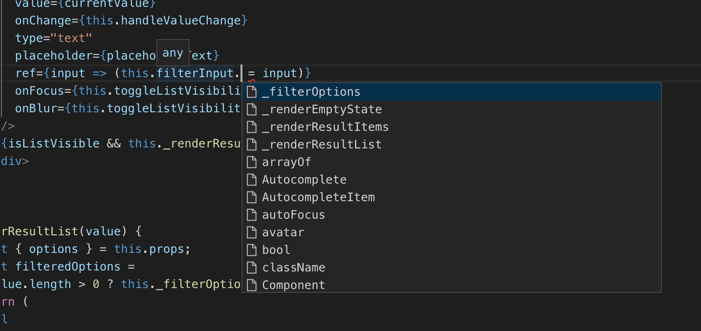
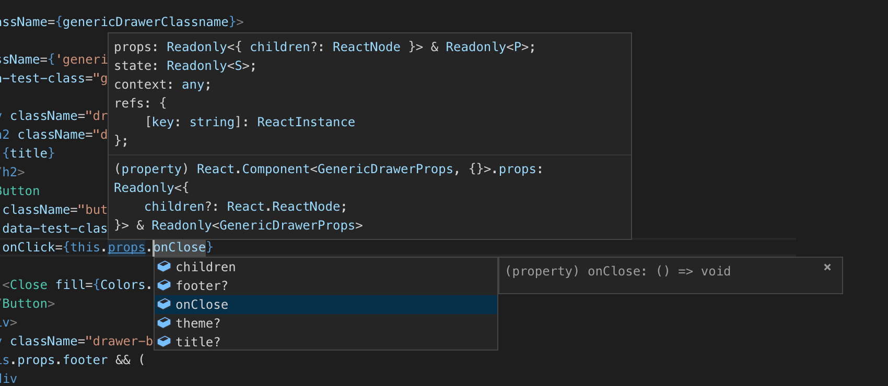

> Note: I wrote this post originally for the [Hootsuite Medium publication](https://medium.com/hootsuite-engineering/). Check it out for more interesting articles.

I'm going to go into the why and how of migrating a large JavaScript code base to TypeScript. Our team has concluded a fifteen month long journey of revamping our front-end stack. To up the difficulty, we had to did this in parallel with delivering new features to our customers. At the end I will also talk about whether it was worth the effort or not, and how it affected our development.

## Start with "why?"

[Hootsuite Analytics](https://hootsuite.com/pages/analytics) is a single page app built from the ground up in JavaScript. We rely on the [React](https://reactjs.org/) library, of which we were very early adopters. At a very high level, our app consumes data from our set of backend APIs. It then transforms that data into several types of visualisations. We render rich tables that display social media posts, charts, graphs, maps, and more.

Over time our app has grown quite a bit, and is now sitting somewhere at 150 thousand lines of code. At Hootsuite we invest a lot in the technical aspects of our products. We do that by always assessing whether what we are doing is sound from a technical point of view. Any major project must start from a problem definition, so let's talk about what were our technical challenges.

---

JavaScript is a difficult language to model data transformations in. It is a dynamic language, and, without going too much into the specifics of what that means, it requires developers to make a trade-off. They don't need to specify what data looks like before hand, which makes initial development very fast. The flip side is that, as a project grows both in lines of code and number of contributors, it becomes exponentially more difficult to reason about the data flow throughout the various layers of the application.

This problem is somewhat compounded by using React. Since it is built on functional programming principles such as immutability and composition over inheritance, it encourages developers to treat components as small, reusable functions. In a medium or large application it's typical to have hundreds, thousands (or even [tens of thousands](https://github.com/facebook/react/issues/9463#issuecomment-295643228)) of components. Data can flow through tens of components at a time.

Imagine having to read through a tree of a dozen React components with no information on what the data looks like at each step. This was what the world looked like in 2015 to us. Now, as astute readers will point out, React offers a feature that helps with this: [PropTypes](https://reactjs.org/docs/typechecking-with-proptypes.html). But they are optional and quite difficult to maintain. We didn't use them from the beginning, we adopted them a year later and started adding them to new components. In our experience they did not deliver enough information to balance the maintenance effort required. There are also more practical concerns: most IDEs do not attempt to parse PropTypes to offer hints, you need tools to enforce their correctness, and it is a limited type system, not robust enough for our needs.

VSCode trying to be useful but lacking context to provide relevant autocomplete

Another problem we experienced was that, due to a lack of information about the data flow, it was difficult to perform basic refactoring. Moving files around, splitting large components into smaller ones, or renaming files — these operations were both time consuming and risky. Our team embraced unit-testing since the very beginning, so we could not crash our app by moving files around. But it was still time consuming.

This led to an interesting realisation: developers rarely refactor code unless it is cheap and safe to do so. The reality was that our code base was in a dire technical debt state. Developers were wary of making major changes for fear of breaking functionality or spending too much time on what they initially thought to be basic tasks.

The lack of code completion and contextual hints was the third, and most annoying problem of all. Myself and a few members of our team come from a back-end development background, working with strongly typed languages such as Java or C++. I still remember the first time I wrote JavaScript code in an IDE. As I was working, all I could think of was…

> Wow, writing code without any IDE suggestions is hard!

You do get used to it after a while, but in my opinion, you will never be quite as productive as in typed languages. There is too much going on at any given moment within a JavaScript program. There are too many possibilities, data can have any shape and can mutate at any time without warning.

So to sum it up, we were facing three major challenges:

- Difficulty in following the data flow
- Expensive refactoring
- Lack of contextual information in IDEs

---

We decided to start the search for a solution, and we realised we had to go outside the bounds of the JavaScript ecosystem to find one. We took a look at what the open-source community offered as options for front-end development. It is an amazing time to be building web apps as there are many, many choices beyond JavaScript.

We did have a very critical restriction. Hootsuite is a business, millions of customers across the world depend on us, so we couldn't stop development while we migrated our code to another language. The migration had to be gradual. We would write new code in our new language, while slowly rewriting older code, without interfering with the product roadmap we had to ship. So we made a shortlist of options, and debated them one by one.

Hootsuite Analytics Report

One of the first languages we took a look at was [Elm](https://elm-lang.org/). Bogdan Zaharia, a member of our team, is a huge proponent of functional programming in its purest form. He was the one that introduced this language to our team. Elm was inspired by Haskell, and offers a robust, typed alternative to JavaScript. While attractive, we couldn't make the transition to it easily. We could not find a simple way to gradually adopt Elm into our code base. Additionally, it's not very newbie friendly. It requires developers to understand some non-trivial concepts from the functional programming world. We also had to consider how easy it would be to onboard new developers in our team to Elm. After weighing in all these drawbacks, we decided to keep looking.

Other options that we analysed:

- [Dart](https://www.dartlang.org/): this language is becoming popular again due to Google investing in [Fuchsia](https://en.wikipedia.org/wiki/Google_Fuchsia). Dart is its de-facto UI tech stack. The lack of a transparent roadmap and uncertain future meant a very clear no go.
- [PureScript](http://www.purescript.org/): this is Haskell for front-end development. Same arguments as using Elm. To be honest, it has an even steeper learning curve than Elm.

We had two candidates left on our list: [Flow](https://flow.org/) and [TypeScript](https://www.typescriptlang.org/).

It was not easy to choose between these two given their similarities. We invested some time in research spikes to see first hand what development looked like in both cases. What we found was that Flow was more difficult to set up than TypeScript, and that the developer experience felt sluggish. This has improved though in the last year, so if we were to analyse them again today, this wouldn't have made such a big difference.

Both type systems are solid, yet very different. TypeScript uses a structural type system. Flow's system is both structural and nominal. The difference is key to how they integrate with the greater JavaScript ecosystem. I will summarise what that means, but if you're interested, [this article](http://wiki.c2.com/?NominativeAndStructuralTyping) goes into much more depth. A nominal type system implies that two types, *Foo* and *Bar*, are never equal, regardless of their definitions. TypeScript, using only the structural alternative, doesn't care about what the types are called. It analyses their structure and determines whether it should act like they are equal. In practice this means writing code is less demanding on you. You can easily reuse types and interfaces and you can even define them inline without naming them.

We also looked at the communities around these two projects. Flow is a language that, at least a year ago when we ran this analysis, was being driven by Facebook in a very closed manner. Development was never transparent, there was no public roadmap, and very few people outside of Facebook were contributing to the project. TypeScript, in contrast, embraced open-source development since moving to GitHub a few years ago. They keep an up-to-date roadmap, accept outside contributions, and generally keep a very close relationship to the community. [Anders Hejlsberg](https://twitter.com/ahejlsberg?lang=en), a Microsoft fellow and chief architect, speaks at conferences (such as [TSConf](https://tsconf.io/)) throughout the year, keeping everyone in the loop on what features are coming next and how the project is performing.

So as you might have guessed, we chose to go with TypeScript. This was a pretty long intro on why we did it, but it serves as a good template for other teams when deciding to change tech stacks. I've seen too many teams do tech switches by starting with the "how", rather than the "why". Rather than stating that your team wants to switch over to another language (or stack), start by understanding your problems.

1. What are our current difficulties?
1. How do we prioritise them?
1. Are they solvable within the current stack?

You should always go through these steps so that you may reach the best possible solution.

## Continue with "how?"

At this point we had reached a consensus that we wanted to begin rewriting our code base in TypeScript. The first step we took was to ensure that we could actually write TypeScript code.

We built Hootsuite Analytics on top of modern software practices. We have a continuous integration pipeline that helps us deliver code to production only after changesets pass several checks:

- Linting
- Formatting (using Prettier)
- Unit-tests
- Code coverage
- Acceptance tests

We have three different environments: development, staging, and, of course, production. When thinking about adding TypeScript, we had to make sure it didn't interfere with the pipeline. And we also had to make it seamless for developers.

I won't go too much into the specific technical details of how we integrated TypeScript into our code base. There are far too many excellent articles and tutorials out there that describe the process better than I can, and I suggest you check them out:

- https://www.typescriptlang.org/docs/handbook/migrating-from-javascript.html
- https://medium.com/pleo/migrating-a-babel-project-to-typescript-af6cd0b451f4
- https://medium.com/@clayallsopp/incrementally-migrating-javascript-to-typescript-565020e49c88

I will, however, describe our philosophy, our pain points, and what we've learned along the way.

---

One of the most important decisions we made at the beginning was to enforce **[strict mode](https://blog.mariusschulz.com/2017/06/09/typescript-2-3-the-strict-compiler-option)**. Strict mode is a combination of several compiler flags that, when turned on, perform extra type safety checks on your code. I would recommend any team that starts a TypeScript project to use strict mode from the get-go. Moving code written in non-strict mode over to strict mode is actually really difficult, and you'll save yourself time in the long term by enabling this mode early.

One of the potential downsides of strict mode is that you can no longer import JavaScript code unless it provides a TypeScript declaration file. If you're not familiar with that term, it's like a C/C++ header. You need to write types for your data structures, classes, methods, and functions. A lot of projects include declaration files written by the maintainers. However we depended on a few that did not.

To solve this issue the community has done an amazing job with the [DefinitelyTyped](https://github.com/DefinitelyTyped/DefinitelyTyped) repository, filling in for authors who have neither the time, interest, or expertise to write and maintain their own declaration files. We didn't have any problems finding declarations for all of our dependencies after consulting it. Unfortunately we did run into a few problems upgrading them down the line. For reasons better explained in [this GitHub issue](https://github.com/DefinitelyTyped/DefinitelyTyped/issues/7719#issuecomment-299393764), it can be challenging to find the right combination of versions. With projects such as [Redux](https://redux.js.org/) (which we use and love), there's an entire ecosystem of dependent projects, each with their own community driven declaration files. You usually need to upgrade all of them at once so as you can imagine, it can get frustrating.

To make matters worse, our app depended on a few in-house written and hosted packages, and they were all JavaScript. As a result importing them would break under strict mode, so we had a new problem on our hands. We had two options: either ignore the compiler errors (using @ts-ignore), or write the declaration files ourselves.

To not get stuck on this particular problem we ignored the import errors. We made a commitment to go back and write the declaration files (which we did, in time). I would recommend this approach to other teams as well, since if you're just getting started with TypeScript, it's a strain to write declaration files. Depending on how dynamic your APIs are, it could require intricate knowledge of the type system to finish. In the early adoption days when you're getting the hang of things, you don't want to be spread too thin.

Another challenge we had was linting. During our research we found two ways of linting TypeScript code: [TSlint](https://palantir.github.io/tslint/), a tool developed in-house at Palantir and subsequently open-sourced, and [ESlint](https://eslint.org/), the de-facto linting tool for JavaScript, together with [typescript-eslint-parser](https://github.com/eslint/typescript-eslint-parser).

We were already using ESLint in our pipeline, so our solution was to adopt a dual setup of ESlint to check JavaScript code, and TSlint for the new code. This felt right at the time since we thought about using the best tools for the job, but it brought a lot of downsides. We had to maintain two linting configuration files, two lists of rules, we had more dependencies we needed to keep track of, and we had two different linting outputs whenever there were errors.

Fast forward a couple of months we consolidated on ESlint for checking both JavaScript and TypeScript code. We accepted that, even though we lost some more advanced TSlint specific rules, it was not worth the effort of keeping both tools in our pipeline.

---

With tooling solved, we had to decide how to approach the code migration. Like I mentioned earlier, there would be no huge one time rewrite, we had to continue supporting our product roadmap, which meant delivering features and maintaining the application. We ended up with two rules that would guide our work.

- New code must *always* be written in TypeScript. No exceptions.
- The code base will be treated as a copy-on-write data structure. If your task requires you to change JavaScript code, you need to rewrite it.

As you can imagine, this didn't always go smoothly. While writing new code was fun in TypeScript, importing legacy code remained an issue. Our first few pull requests were unusually large, and thus difficult to peer review. We tried to get to the bottom of the problem during our weekly JavaScript Guild meetings. It turned out that often developers needed to go into the legacy modules and fix problems that were just then being uncovered by the compiler. So pull requests that should've included one or two files were now hundreds or even thousands of lines in size because of our second migration rule.

We still wanted to uphold the vision, so we decided to take a look at the major offenders that were causing the large changesets. These were mostly older core React components or utility functions. These modules had been reused across the entire project, so changes made to them cascaded across the entire codebase. Rather than spend time upfront in rewriting them, which would have potentially caused delays in our product roadmap, we wrote declaration files for them. This helped a lot in reducing the size of subsequent pull requests. We delayed rewriting these modules until we were further along with the migration.

If your team does this, word of warning — you are, in effect, adding **technical debt**. You will need to maintain these files, which is not simple. It is very easy to change JavaScript code without updating the corresponding declaration files. Your app will compile but crash and burn at runtime. In practice, we very rarely had this problem, due to our decent unit-test coverage. Try not to keep the declaration files forever, though, and commit to rewrite your code at some point.

Better — autocomplete for React props, and documentation on React internals!

Of course we also *shipped* some bugs in production during rewrites. The amazing value in type systems is that you can catch so many bugs at compile time instead of runtime. That was never the case for us before the migration, though, so we had a lot of lingering bugs waiting for the right conditions to manifest themselves.

## Was it worth it?

The best measure of success that we have so far is the number of production deployments. We built our pipeline in such a way that any merged pull requests trigger a production release. This means we push new releases out to customers on a daily basis. Our hunch was that, due to the uncertainty that governed our code base before the migration, we never deployed as often as we could have. And we were right.

The number of production deployments per work day

The number of times we release to production has doubled compared to 2017.

It's never easy to attribute statistical success, so I am going to eliminate the usual suspects that may have influenced this chart.

The number of front-end developers on our team has largely remained constant. So while there is some correlation between headcount and production pushes, it is not enough to explain the trend.

We did not put Analytics as a product on pause, our roadmap has been a constant flux of features, so that's also out of the question. There are some seasonality influences. We enjoy a peaceful code freeze during Christmas holidays each year. During that time we cannot push any code to production. This explains the low activity at the end of each year.

We are still early in analysing the impact this migration has had on our code base. Quantitative data suggests we are shipping more often than ever before. Qualitative information is also very valuable. Our developers love the contextual information that the types offer (especially now that everyone in the team uses [VSCode](https://code.visualstudio.com/) or WebStorm). They are writing less tests because bugs are now uncovered during compilation. They are generally happier about the quality of their code. On-boarding new developers into the project, which historically has been very difficult, is now faster. We plan to do another check-up in six months and see if these initial results still hold up.

You would think that this migration affected our product roadmap, due to all the refactoring work. That was not the case for us. We managed to deliver all our projects on time. The caveat of this is that at Hootsuite we never work under the pressure of fixed, non-negotiable deadlines. I can also attest to the fact that certain features we delivered would have taken much longer had we needed to work in JavaScript. Parts of our code base are approaching four years of age. New features around them would have certainly driven up estimations.

## In closing

This migration would not have been possible without the passion, grit, attention to detail, and hard work by our developers in Hootsuite's Bucharest office. I'd like to thank [Bogdan Zaharia](https://github.com/zaboco/), [Flavius Tîrnăcop](https://github.com/flaviusone), [Gabriel Ilie](https://www.linkedin.com/in/gabriel-ilie-a2429364/), [Sergiu Buciuc](https://www.linkedin.com/in/sergiubuciuc/), and [Sînziana Nicolae](https://www.linkedin.com/in/sinziana-nicolae-80516a5b/) for keeping the TypeScript dream alive, and in general for an amazing past year. I'm happy and proud to be working on a team that can get motivated when faced with a project like this. Looking forward to our next achievements.

Have you ever migrated a code base to another language? Share your experience in the comments, and let us know if you found this article useful.
